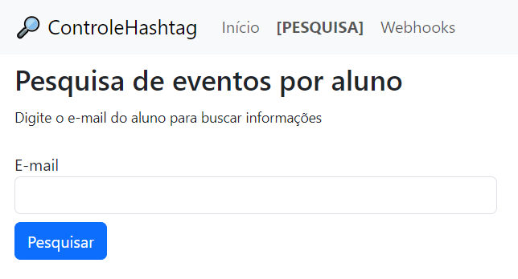

# API_Webhook_Hashtag
Aplicação para receber webhook e fazer tratamentos dos dados  
  
Projeto: Desafio Python Hashtag.  
Esse sistema foi desenvolvido em `Python` com `Flask` e `Bootstrap` por Felipe Seleme Ribeiro.  
  
 
Para utilizar as informações e recursos, é necessário criar uma conta e fazer login.  
  
  
# Objetivo: Criar uma `API` que receba `Webhooks` de um simulador, fazer as tratativas e armazenar os dados em um banco de dados.  
  
  ## Sumário
  [main.py](main.py) - executa a aplicação.
  
  [init](flaskwebsite/__init__.py) - inicializa a aplicação.  
  [forms.py](flaskwebsite/forms.py) - formulários para criação de conta e login.  
  [models.py](flaskwebsite/models.py) - modelos de dados para criação de conta e login.  
  [routes.py](flaskwebsite/routes.py) - rotas para as páginas de consulta e webhooks.  
    
  [templates](flaskwebsite/templates) - páginas html.  
  [navbar.html](flaskwebsite/templates/navbar.html) - barra de navegação.  
  [base.html](flaskwebsite/templates/base.html) - base para as páginas.  
  [home.html](flaskwebsite/templates/home.html) - página inicial.  
  [hooks.html](flaskwebsite/templates/hooks.html) - página de webhooks.  
  [pesquisa.html](flaskwebsite/templates/pesquisa.html) - página de pesquisa.  
  [rersultado_pesquisa.html](flaskwebsite/templates/resultado_pesquisa.html) - página de resultado da pesquisa.  
  [criarconta.html](flaskwebsite/templates/criarconta.html) - página de criação de conta.  
  [login.html](flaskwebsite/templates/login.html) - página de login.  

  
O sistema foi elaborado para ser funcional, simples e intuitivo em sua aplicação.  
Ele recebe as informações simuladas de confirmações de pagagmentos de usuários de uma plataforma e faz os tratamentos de acordo com as regras definidas.  
Ele possui um gerenciamento de usuários para acesso às informações (é necessário criar uma conta e estar logado).  
Estando logado, o usuário tem acesso às duas abas de consulta: [PESQUISA] e Webhooks.  
  
[PESQUISA]: Busca pelos registros de uma pessoa específica por meio do seu e-mail.  
Webhooks: Lista em uma tabela os últimos registros recebidos e as tratativas realizadas pelo sistema.  

## Webhooks  
O sistema recebe os dados do webhook e faz as tratativas:  
    
  
## Pesquisa
O sistema faz a busca por e-mail e retorna os dados da pessoa:  
  
  
## Licença
Copyright (c) 2023 Felipe Seleme Ribeiro